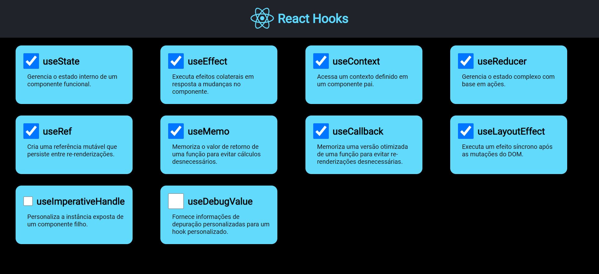
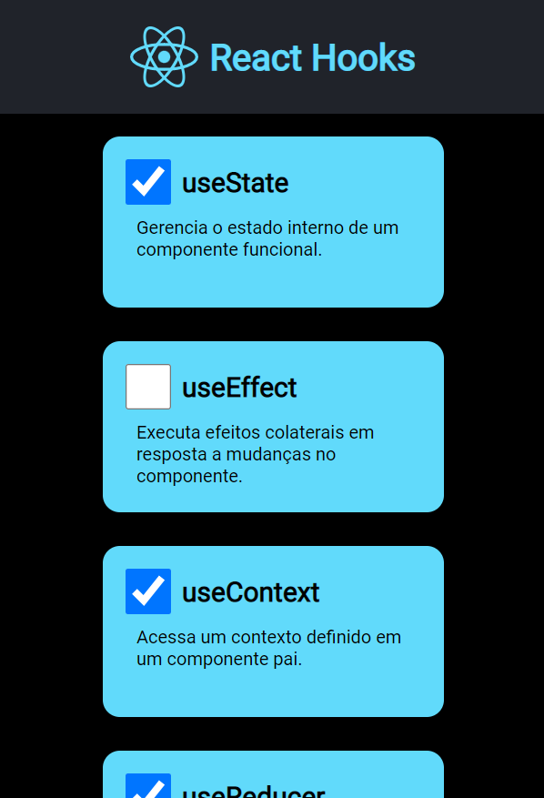

# React Project - Hooks-React
### Welcome to the React project repository, a static page containing 10 cards, each with a hook and its respective functionality.

#### Here are the hooks used in this project:

- > useState: Allows adding state to functional components.
- > useContext: Facilitates data sharing between components without the need to manually pass props.
- > useReducer: Manages complex states and updates in a more structured way.
- > useCallback: Memorizes functions to avoid unnecessary re-creations during re-renders.
- > useMemo: Memorizes computed values to avoid unnecessary recalculations.
- > useRef: Provides a mutable reference that persists between re-renders.
- > useImperativeHandle: Allows customizing the value exposed by a parent component when used in conjunction with ref.
- > useLayoutEffect: Similar to useEffect, but synchronous and runs before the screen update.
- > useDebugValue: Allows customizing the value shown for a custom hook in DevTools.

## Layout:

## Layout Mobile:

## Installation and Execution:
> Make sure you have Node.js and npm (or yarn) installed on your machine.

Clone this repository to your local environment.
Navigate to the project directory in the terminal.
Run the command npm install or yarn install to install the dependencies.

### Technologies:
- HTML
- CSS
- JavaScript
- React